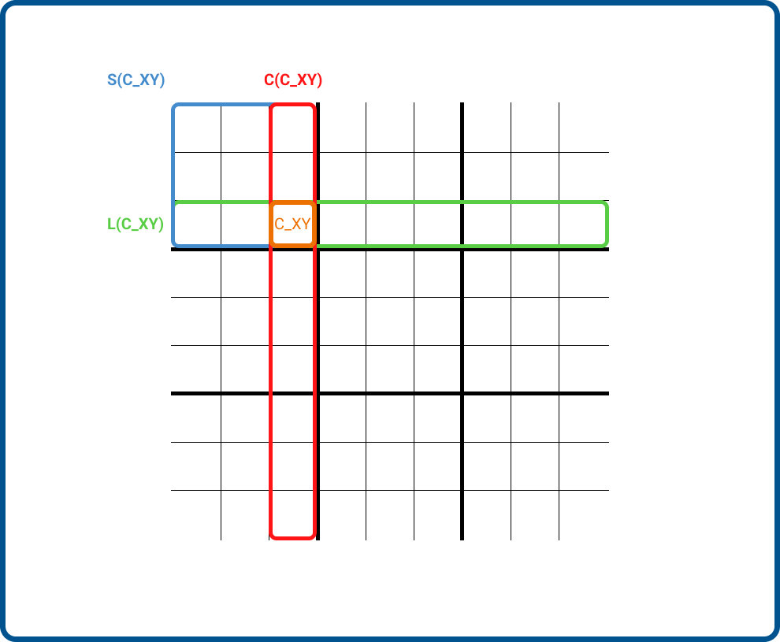
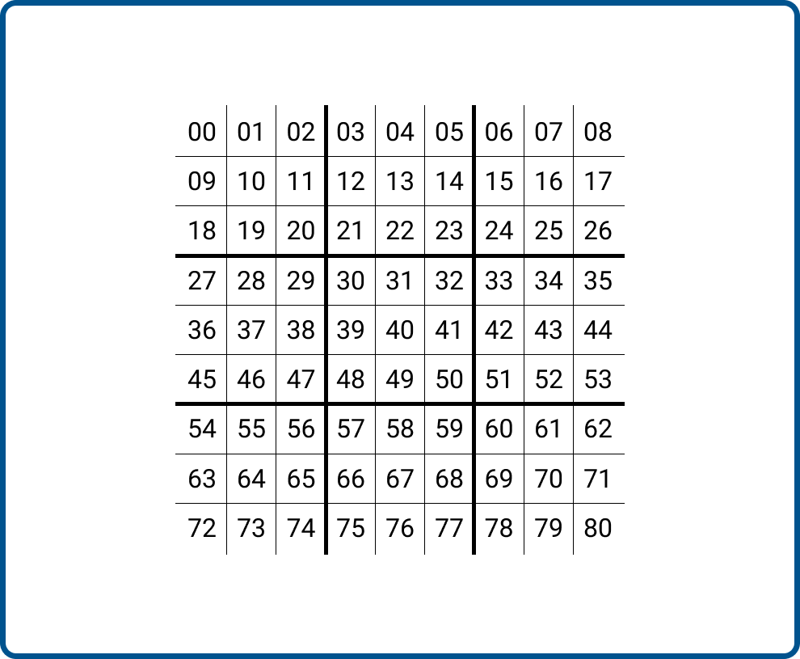
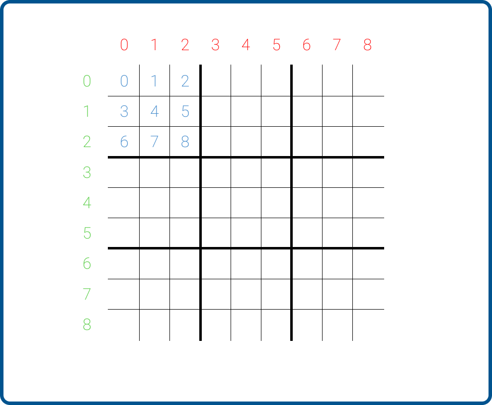

# Sudoku Solver

This program try to achieve the solving of any Sudoku.

## Basics

Before starting to code anything, I started by thinking about "how could I model sudoku ?".

To answer this, I remembered my courses at university talking about [Constraint Satsifaction Problems](https://en.wikipedia.org/wiki/Constraint_satisfaction_problem) or CSP. I quickly guessed that this particular approach was the best way to solve a Sudoku.

In order to solve a CSP, you need to have 3 elements in your problems :

- **Variables** : They corresponds to the elements taht should be positioned.
- **Domains of the variables** : The values that our variables can take
- **Constraints** : The constraints that our variables must respect.

To model this problem, I tried to figure out which elements needed to be considered.

### Variables considered

I did not know really what to consider. Should I consider numbers, lines, columns or something else ?

I chose to consider directly cells with some metadata :

- Value : to compare the values inside a cell.
- Line : to know if the number is in a particular line.
- Column : to know if the number is in particular column.
- Square : to know if the number is in a particular square.

To simplify the notations, one uses some acronyms :

- **C_XY** : is a cell indexed XY (07 by example)
- **L(C_XY)** : is the line of the cell
- **C(C_XY)** : is the column of the cell
- **S(C_XY)** : is the squared of the cell
- **V(C_XY)** : is the value inside of the cell

To give a unique identifier for each cell, I chose to name it according to a left-right, top-bottom numeration.

  
   

### Variables domains

The variables are **L(C_XY)**, **C(C_XY)**, **S(C_XY)** & **V(C_XY)**.

Their respective domains are :

- **L(C_XY)** : *{0,1,2,3,4,5,6,7,8}*
- **C(C_XY)** : *{0,1,2,3,4,5,6,7,8}*
- **S(C_XY)** : *{0,1,2,3,4,5,6,7,8}*
- **V(C_XY)** : *{1,2,3,4,5,6,7,8,9}*

  

### Constraints

Finally, the key part of this analysis : the constraints.

They directly come from the rules of the sudoku game :

- **Line Constraint** : {L(C_XY) = L(C_ZW); V(C_XY) != V(C_ZW)}
- **Column Constraint** : {C(C_XY) = C(C_ZW); V(C_XY) != V(C_ZW)}
- **Square Constraint** : {S(C_XY) = S(C_ZW); V(C_XY) != V(C_ZW)}
