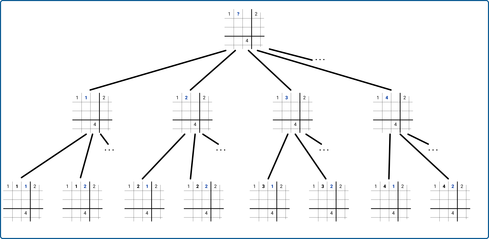
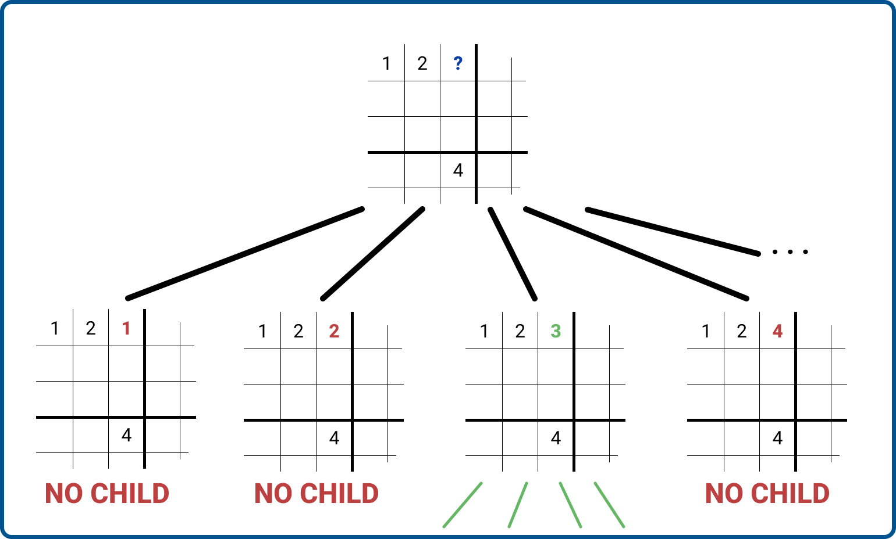
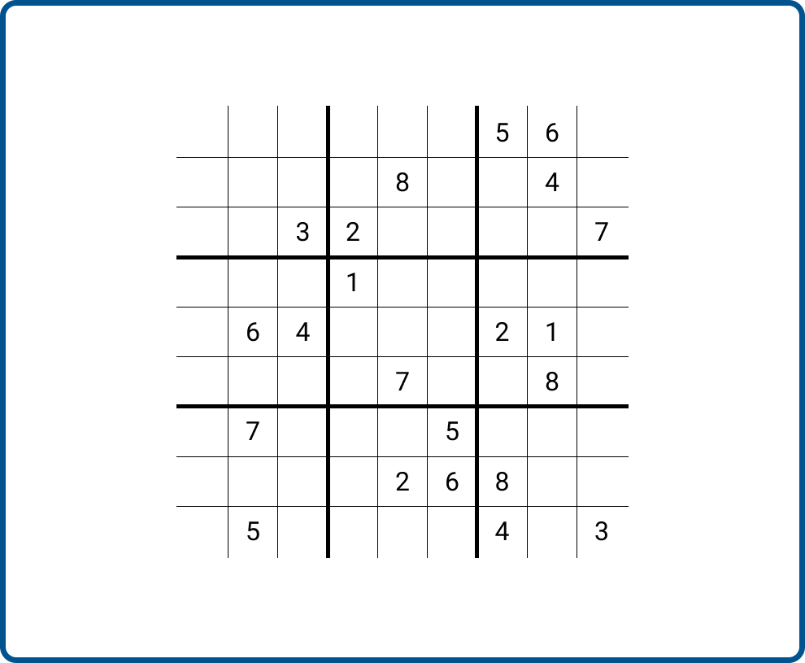
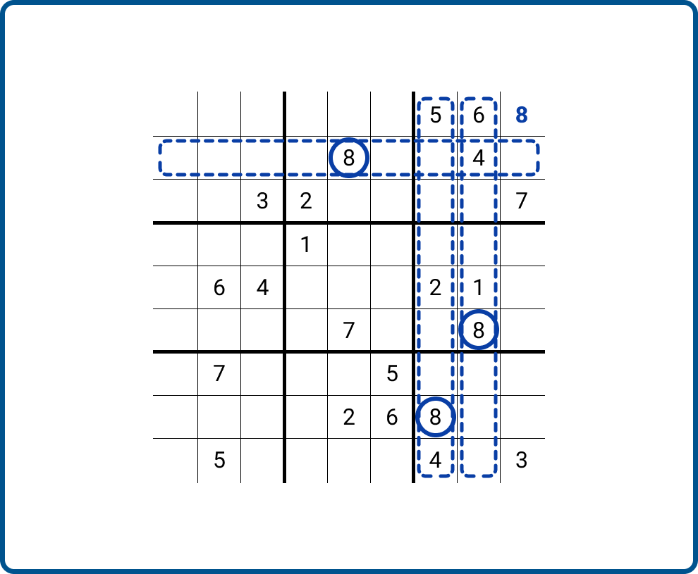
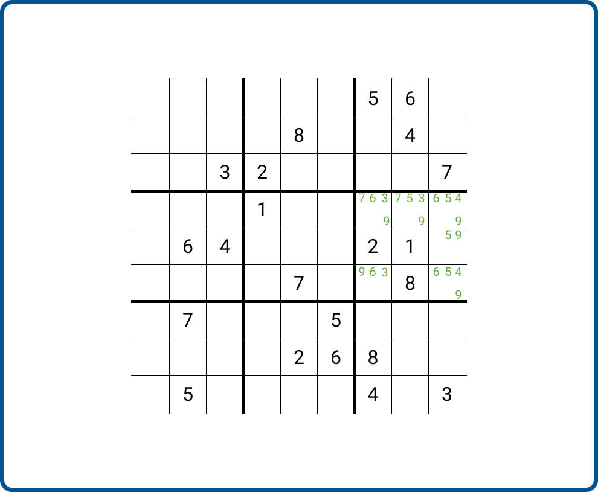
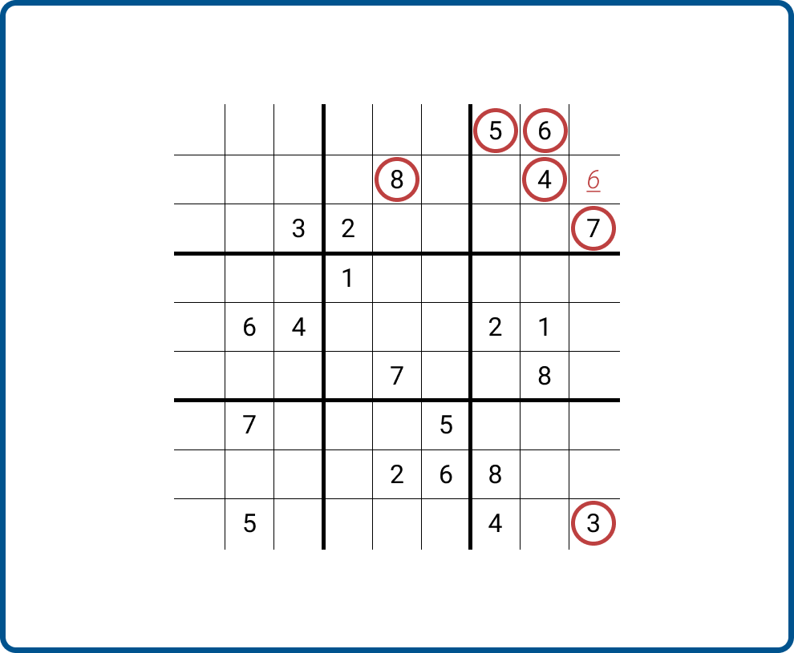

# Sudoku Solver

This program try to achieve the solving of any Sudoku.

## Basics

Before starting to code anything, I started by thinking about "how could I model sudoku ?".

To answer this, I remembered my courses at university talking about [Constraint Satsifaction Problems](https://en.wikipedia.org/wiki/Constraint_satisfaction_problem) or CSP. I quickly guessed that this particular approach was the best way to solve a Sudoku.

In order to solve a CSP, you need to have 3 elements in your problems :

- **Variables** : They corresponds to the elements taht should be positioned.
- **Domains of the variables** : The values that our variables can take
- **Constraints** : The constraints that our variables must respect.

To model this problem, I tried to figure out which elements needed to be considered.

### Variables considered

I did not know really what to consider. Should I consider numbers, lines, columns or something else ?

I chose to consider directly cells with some metadata :

- Value : to compare the values inside a cell.
- Line : to know if the number is in a particular line.
- Column : to know if the number is in particular column.
- Square : to know if the number is in a particular square.

To simplify the notations, one uses some acronyms :

- **C_XY** : is a cell indexed XY (07 by example)
- **L(C_XY)** : is the line of the cell
- **C(C_XY)** : is the column of the cell
- **S(C_XY)** : is the squared of the cell
- **V(C_XY)** : is the value inside of the cell

To give a unique identifier for each cell, I chose to name it according to a left-right, top-bottom numeration.

<p align="middle">
  
   
</p>

### Variables domains

The variables are **L(C_XY)**, **C(C_XY)**, **S(C_XY)** & **V(C_XY)**.

Their respective domains are :

- **L(C_XY)** : *{0,1,2,3,4,5,6,7,8}*
- **C(C_XY)** : *{0,1,2,3,4,5,6,7,8}*
- **S(C_XY)** : *{0,1,2,3,4,5,6,7,8}*
- **V(C_XY)** : *{1,2,3,4,5,6,7,8,9}*

<p align="middle">
  
</p>

### Constraints

Finally, the key part of this analysis : the constraints.

They directly come from the rules of the sudoku game :

- **Line Constraint** : {L(C_XY) = L(C_ZW); V(C_XY) != V(C_ZW)}
- **Column Constraint** : {C(C_XY) = C(C_ZW); V(C_XY) != V(C_ZW)}
- **Square Constraint** : {S(C_XY) = S(C_ZW); V(C_XY) != V(C_ZW)}

## Strategy

To solve this problem I chose to use the most basic AI algorithm existing for solving CSP : **[Generate & Test](https://en.wikipedia.org/wiki/Brute-force_search)**.

This approach is pretty barbaric without the use of some heuristic but it can become really good if one choose to not generate every possible case!

I chose to implement an algorithm that look like [this one by Christine SOLNON](https://perso.liris.cnrs.fr/christine.solnon/Site-PPC/session3/e-miage-ppc-sess3.htm#va_voir_1) (in french) :

```
function generateAndTest(A,(X,D,C)) : return boolean

Precondition :
(X,D,C) = A CSP on the finite domains
A = a partial allocation for (X,D,C)

Post-relationship :
return true if the partial allocation A can be extended in one solution for (X,D,C), false otherwise

Begin
  If every variable from X are allocated to a value in A Then :    /* A is a total allocation */
    If A is consistent Then
      /* A is a solution */
      return True
    Else
      return False
    EndIf
  Else                                                             /* A is a partial allocation */
    choose a variable Xi of X which is not yet allocated to a value in A
    For every value Vi that belongs to D(Xi) Do
      If generateAndTest(A ∪ {(Xi,Vi)}, (X,D,C)) = True Then
        return True
      EndIf
    EndFor
    return False
  EndIf
End
```

I modified it a bit during the implementation to optimize it and not have a "super dumb" algorithm.

## Implementation

### Technology choice : TypeScript

Implementation is always the time where the things become messy. By the past, I tried so many times to make this AI but I messed each time on the implementation. Thankfully, I learn from my mistakes and I started this time by stating well the problem. I knew exactly where I wanted to go before starting to code.

I tried multiple time to use lots of languages to solve this problem : Python, Clojure, Prolog...

This time, I chose to use the TypeScript language! I'm a big fan of JavaScript for its simplicity, its great package base and its tremendous number of functions and data structures. I also know pretty well the memory functioning of this language.

The biggest lack of JavaScript is its gestion of the types which is... non-existent! This is the reason why I chose to use TypeScript, that I know less, but which let me avoid tear my hair out when debugging some AI functions!

### Data representation

The first step to solve an AI problem, and specifically a CSP problem, is to define data structure to represent variables.

So I chose to represent a Cell by a specific class :

```ts
class Cell {
    value: number | null;
    readonly index: number;

    constructor(value: null | number, index: number) {
        this.value = value;
        this.index = index;
    }

    computeCol(): number {
        return this.index % 9;
    }

    computeLine(): number {
        return Math.floor(this.index / 9);
    }

    computeSquare(): number {
        return Math.floor(this.computeCol() / 3) + 3 * Math.floor(this.computeLine() / 3);
    }

    setValue(value: number) {
        this.value = value;
    }

    copy() {
        return new Cell(this.value, this.index);
    }
}
```

I then chose to represent the lines, columns & squares by other classes :

**The column**
```ts
class C {
    index: number;
    cells: Array<Cell>;

    constructor(index: number) {
        this.index = index;
        this.cells = [];
    }

    addCell(cell: Cell) {
        this.cells.push(cell);
    }
}
```

**The line**
```ts
class L {
    index: number;
    cells: Array<Cell>;

    constructor(index: number) {
        this.index = index;
        this.cells = [];
    }

    addCell(cell: Cell) {
        this.cells.push(cell);
    }
}
```
**The square**
```ts
class S {
    index: number;
    cells: Array<Cell>;

    constructor(index: number) {
        this.index = index;
        this.cells = [];
    }

    addCell(cell: Cell) {
        this.cells.push(cell);
    }
}
```

Finally, I chose to represent the CSP problem/particular state/the solution with a class :

```ts
class Problem {
    cols: Array<C>;
    lins: Array<L>;
    squs: Array<S>;
    cells: Array<Cell>;

    constructor() {
        this.cols = [];
        for (let i = 0; i < 9; ++i) {
            this.cols.push(new C(i));
        }
        this.lins = [];
        for (let i = 0; i < 9; ++i) {
            this.lins.push(new L(i));
        }
        this.squs = [];
        for (let i = 0; i < 9; ++i) {
            this.squs.push(new S(i));
        }
        this.cells = [];
    }

    putCellInCol(cell: Cell) {
        let colId = cell.computeCol();
        this.cols.find(col => col.index === colId)?.addCell(cell);
    }

    putCellInLin(cell: Cell) {
        let linId = cell.computeLine();
        this.lins.find(lin => lin.index === linId)?.addCell(cell);
    }

    putCellInSqu(cell: Cell) {
        let squId = cell.computeSquare();
        this.squs.find(squ => squ.index === squId)?.addCell(cell);
    }

    addCell(cell: Cell) {
        this.cells.push(cell);
        this.putCellInCol(cell);
        this.putCellInLin(cell);
        this.putCellInSqu(cell);
    }

    /* ... */

}
```

### First Implementation : Pretty naive implementation

For my first implementation of the [algorithm](#strategy). I chose to improve it a bit.

In fact, this algorithm is pretty much generating a tree of partial solutions until it finds the solution that match the constraints and is a total solution.

<p align="middle">
  
</p>

Because it generates many solutions, I had to make sure that the solutions are not sharing memory between them. If it does, it means that the solution generated will probably interfer between them, which is not an attended beahviour. This is the reason why I wrote functions that ensure to make deep copies of the objects computed :

```ts
class Cell {
    value: number | null;
    readonly index: number;

    /* ... */

    copy() {
        return new Cell(this.value, this.index);
    }
}
```

```ts
class Problem {
    cols: Array<C>;
    lins: Array<L>;
    squs: Array<S>;
    cells: Array<Cell>;

    /* ... */

    /* Copy */
    copy(): Problem {
        let newProblem = new Problem();
        this.cells.forEach(
            function (cell) {
                newProblem.addCell(cell.copy());
            }
        )
        return newProblem;
    }
    
    /* ... */
}
```

Finally, I needed functions to check that the 2 main problems were respected :

- Is the grid complete ?
- Do the grid completion follow the rules ?

#### Grid completion check

For the first question, I just wrote a very simple function that check if one value is not yet filled :

```ts
class Problem {
    cols: Array<C>;
    lins: Array<L>;
    squs: Array<S>;
    cells: Array<Cell>;

    /* ... */

    isComplete() {
        if (this.cells.find(cell => cell.value === null)) {
            return false;
        }
        return true;
    }

    /* ... */
}
```

#### Rules check : first trimming

For the second question, I decided to make a first optimization in the algorithm :

Instead of checking after a full generation that the grid is correct, I prefered to make a first trimming in the tree directly after adding a wrong number. I wrote a function to achieve this, which is called just after a number was inserted into the grid :

- If the line, column and square after the insertion follow the rules of sudoku, then the branch can grow bigger.
- If one or more of the rules are infringed, then the branch is trimmed.

<p align="middle">
  
</p>

**The function that check the conditions :**

```ts
class Problem {
    cols: Array<C>;
    lins: Array<L>;
    squs: Array<S>;
    cells: Array<Cell>;

    /* ... */

    /* Constraints */
    checkLine(index: number) {
        let line = this.lins.find(lin => lin.index === index)?.cells.map(cell => cell.value);
        let valuesCount = this.countValuesArray(line!!);
        if (Array.from(valuesCount.values()).includes(2)) {
            return false;
        }
        return true;
    }

    checkColumn(index: number) {
        let column = this.cols.find(col => col.index === index)?.cells.map(cell => cell.value);
        let valuesCount = this.countValuesArray(column!!);
        if (Array.from(valuesCount.values()).includes(2)) {
            return false;
        }
        return true;
    }

    checkSquare(index: number) {
        let square = this.squs.find(squ => squ.index === index)?.cells.map(cell => cell.value);
        let valuesCount = this.countValuesArray(square!!);
        if (Array.from(valuesCount.values()).includes(2)) {
            return false;
        }
        return true;
    }

    /* ... */

    isCorrect(cellId: number) {
        const linId = Math.floor(cellId / 9);
        const colId = cellId % 9;
        const squId = Math.floor(colId / 3) + 3 * Math.floor(linId / 3);

        if (this.checkLine(linId) && this.checkColumn(colId) && this.checkSquare(squId)) {
            return true;
        }
        return false;
    }

    countValuesArray(arr: Array<(number | null)>): Map<number, number> {
        const counts: Map<number, number> = new Map();
        arr.forEach(
            function (x) {
                if (x !== null) {
                    let val = counts.get(x);
                    if (val !== undefined) {
                        counts.set(x, val + 1);
                    } else {
                        counts.set(x, 1);
                    }
                }
            }
        );
        return counts;
    }

    /* ... */
}
```

#### Heuristic

Now that one has rules to generate the tree from a cell, stays a non resolved problem : how one chooses the cell that should be filled first ?

For this first approach, I chose to use a silly way of selection : **the first cell to comes is the one selected**.

```ts
class Problem {
    cols: Array<C>;
    lins: Array<L>;
    squs: Array<S>;
    cells: Array<Cell>;

    /* ... */

    findFirstEmptyCell(): number | undefined {
        return this.cells.find(cell => cell.value === null)?.index;
    }

    /* ... */
}
```

#### Final algorithm

The finish algorithm looks like this in TypeScript :

```ts
function generateAndTest(problem: Problem): null | Problem {
    if (!problem.isComplete()) {
        let cellIndex = problem.findFirstEmptyCell();
        if (cellIndex === undefined) {
            throw new Error("The problem is already complete !");
        }
        for (let i = 1; i <= 9; ++i) {
            let newPb = problem.copy();
            newPb.setValue(cellIndex, i);
            if (newPb.isCorrect(cellIndex)) {
                let res = generateAndTest(newPb);
                if (res) {
                    return res;
                }
            }
        }
        return null;
    } else {
        return problem;
    }
}
```

#### Test and performances

As a way to see if it works and to see if it runs quickly, I decided to test it with the `time` Unix function :

```bash
tsc index.ts
```

```bash
time node index.js
```

```
[
  [
    null, null, null,
    null, null, null,
    5,    6,    null
  ],
  [
    null, null, null,
    null, 8,    null,
    null, 4,    null
  ],
  [
    null, null, 3,
    2,    null, null,
    null, null, 7
  ],
  [
    null, null, null,
    1,    null, null,
    null, null, null
  ],
  [
    null, 6,    4,
    null, null, null,
    2,    1,    null
  ],
  [
    null, null, null,
    null, 7,    null,
    null, 8,    null
  ],
  [
    null, 7,    null,
    null, null, 5,
    null, null, null
  ],
  [
    null, null, null,
    null, 2,    6,
    8,    null, null
  ],
  [
    null, 5,    null,
    null, null, null,
    4,    null, 3
  ]
]
4 2 7 9 1 3 5 6 8
9 1 5 6 8 7 3 4 2
6 8 3 2 5 4 1 9 7
5 9 8 1 6 2 7 3 4
7 6 4 5 3 8 2 1 9
1 3 2 4 7 9 6 8 5
8 7 1 3 4 5 9 2 6
3 4 9 7 2 6 8 5 1
2 5 6 8 9 1 4 7 3
node index.js  7,76s user 0,10s system 104% cpu 7,502 total
```

**Hooray!** The grid generated is correct! 

...But it tooks around `7,76s` to run on my machine. Let us find out if one can improve it a bit!

### Second Implementation : More developed heuristic

How do you play sudoku in real life ? How do you solve a sudoku ? I do not think that you just try all possible combinations until you meet one that satisifes the problem!

Take this grid as example :

<p align="middle">
  
</p>

It exists a loads of strategies to solve sudoku. Some are really straight forward and are easy to complete and some are way harder to apply for a human.

|  | 
|:-----------------:|:---------:|
| *My favorite strategy. Use the lines and/or adjacent columns to find the value in a specific cell* | *Mark down all the possible values inside a square. This method can be very messy but with only two values, it can be a game changer* |

These methods are really great for human beings but not so much for computers trying to solve CSP...

Something AI makers love is the **attribution of weight/score**. You find weights everywhere in this domain : 

- One weights edges in graphs
- Weights rules a neural network decision
- Weights are used in generative AI to give the best solution

Anyway, when it comes to select the best solution, one likes to put a weight on it!

#### Score Strategy

To improve the AI, I decided to change the heuristic that chose the first cell to compute. I will try again to minimize the branches by selecting the ones that will generate less leaves.

To do that, I will use a score heuristic. I will put a score on each cell and starting to compute the cell with the biggest score. This score will depend on the number of already taken values for this cell.

In the following example, the focused cell has a score of `6` because the value of the cell cannot be *{3, 4, 5, 6, 7, 8}* which corresponds to **6 values**.

<p align="middle">
  
</p>

The cells with a better score will have less possibilities and will, then, generate less leaves.

#### Implementation

For the implementation, I started by adding the score property to the cells :

```ts
class Cell {
    value: number | null;
    readonly index: number;
    score: number | null;

    constructor(value: null | number, index: number) {
        this.value = value;
        this.index = index;
        if (this.value === null)
            this.score = 0;
        else
            this.score = null;
    }

    /* ... */

    setScore(score: number | null): number | null {
        this.score = score;
        return this.score;
    }

    /* ... */
}
```

Then, I added methods to the problem to compute the score of a cell :

```ts
class Problem {
    cols: Array<C>;
    lins: Array<L>;
    squs: Array<S>;
    cells: Array<Cell>;

    /* ... */

    getSetLin(linIndex: number): Set<number | null> {
        let line = this.lins.find(lin => lin.index === linIndex)?.cells.map(cell => cell.value);
        return new Set(line);
    }

    getSetCol(colIndex: number): Set<number | null> {
        let column = this.cols.find(col => col.index === colIndex)?.cells.map(cell => cell.value);
        return new Set(column);
    }

    getSetSqu(squIndex: number): Set<number | null> {
        let square = this.squs.find(squ => squ.index === squIndex)?.cells.map(cell => cell.value);
        return new Set(square);
    }

    getCellScore(cellId: number): number | null {
        const cell = this.cells.find(cel => cel.index === cellId);
        if (cell?.value !== null) {
            cell?.setScore(null);
            return null;
        }
        const linId = Math.floor(cellId / 9);
        const colId = cellId % 9;
        const squId = Math.floor(colId / 3) + 3 * Math.floor(linId / 3);

        let scoreSet = new Set([...this.getSetLin(linId), ...this.getSetCol(colId), ...this.getSetSqu(squId)]);
        return cell.setScore(scoreSet.size);
    }

    /* ... */
}
```

Finally, I added 2 methods to update the cells :

- One method, used at the beginning, will compute the score of every cell
- One second method will only compute the score of cells which are susceptible to have evolved after setting a value in a specific cell.

```ts
class Problem {
    cols: Array<C>;
    lins: Array<L>;
    squs: Array<S>;
    cells: Array<Cell>;

    /* ... */

    globalUpdateScore(): number | undefined {
        let max = -1;
        let curScore: number | null;
        let indexMax: number | null = null;
        for (let cell of this.cells) {
            curScore = this.getCellScore(cell.index);
            if (curScore !== null && curScore > max) {
                max = curScore;
                indexMax = cell.index;
            }
        }
        return indexMax === null ? undefined : indexMax;
    }

    localUpdateScore(cellId: number) {
        const linId = Math.floor(cellId / 9);
        const colId = cellId % 9;
        const squId = Math.floor(colId / 3) + 3 * Math.floor(linId / 3);

        let line = this.lins.find(lin => lin.index === linId);
        let column = this.cols.find(col => col.index === colId);
        let square = this.squs.find(squ => squ.index === squId);

        let toCompute = [...line!!.cells, ...column!!.cells, ...square!!.cells];

        for (let cell of toCompute) {
            this.getCellScore(cell.index);
        }
    }

    /* ... */
}
```

#### Heuristic

To use all the functions previously defined, I stated an heuristic based on the score to select a cell :

```ts
class Problem {
    cols: Array<C>;
    lins: Array<L>;
    squs: Array<S>;
    cells: Array<Cell>;

    /* ... */

    findMostConstraints(): number | undefined {
        let max = -1;
        let curScore: number | null;
        let indexMax: number | null = null;

        for (let cell of this.cells) {
            curScore = cell.score;
            if (curScore !== null && curScore > max) {
                max = curScore;
                indexMax = cell.index;
            }
        }

        return indexMax === null ? undefined : indexMax;
    }

    /* ... */
}
```

I modified a bit the algorithm to take this new heuristic in account :

```ts
function generateAndTest2(problem: Problem, cellIndex: number | undefined): null | Problem {
    if (!problem.isComplete()) {
        if (cellIndex === undefined) {
            throw new Error("The problem is already complete !");
        }
        for (let i = 1; i <= 9; ++i) {
            let newPb = problem.copy();
            newPb.setValue(cellIndex, i);
            if (newPb.isCorrect(cellIndex)) {
                newPb.localUpdateScore(cellIndex);
                let nextCell = newPb.findMostConstraints();
                let res = generateAndTest2(newPb, nextCell);
                if (res) {
                    return res;
                }
            }
        }
        return null;
    } else {
        return problem;
    }
}
```

During the initialization, one must compute a first time the scores of the cells :

```ts
let firstCell = problem.globalUpdateScore();
let res = generateAndTest2(problem, firstCell);
```

#### Test and performances

Now let us try this new implementation on the same grid as one has done before :

```bash
tsc index.ts --downlevelIteration   
```

```bash
time node index.js
```

```
[
  [
    null, null, null,
    null, null, null,
    5,    6,    null
  ],
  [
    null, null, null,
    null, 8,    null,
    null, 4,    null
  ],
  [
    null, null, 3,
    2,    null, null,
    null, null, 7
  ],
  [
    null, null, null,
    1,    null, null,
    null, null, null
  ],
  [
    null, 6,    4,
    null, null, null,
    2,    1,    null
  ],
  [
    null, null, null,
    null, 7,    null,
    null, 8,    null
  ],
  [
    null, 7,    null,
    null, null, 5,
    null, null, null
  ],
  [
    null, null, null,
    null, 2,    6,
    8,    null, null
  ],
  [
    null, 5,    null,
    null, null, null,
    4,    null, 3
  ]
]
4 2 7 9 1 3 5 6 8
9 1 5 6 8 7 3 4 2
6 8 3 2 5 4 1 9 7
5 9 8 1 6 2 7 3 4
7 6 4 5 3 8 2 1 9
1 3 2 4 7 9 6 8 5
8 7 1 3 4 5 9 2 6
3 4 9 7 2 6 8 5 1
2 5 6 8 9 1 4 7 3
node index.js  0,25s user 0,03s system 173% cpu 0,162 total
```

**Here we are!!!** One obtains the same result but in way lesser time! (`0.25s`)

## Conclusion

You can access the final AI (and the previous one if you want) on this website : [Sudoku-v-Online](lsacienne.github.io/sudoku_solver).

I am very proud of this AI, I wanted to realize it from a long time ago and I am very happy of the result. I hope this piece of code will inspire you ! 

See you later!

<table>
    <thead>
        <tr>
            <th colspan="5">L'Sacienne</th>
        </tr>
    </thead>
    <tbody>
        <tr>
            <td colspan="1" width=10%></td>
            <td colspan="1" align="center">VIALA ALexandre</td>
            <td colspan="1" align="center"><a href="https://lsacienne.github.io/portfolio/#/">My portfolio</a></td>
            <td colspan="1" align="center"><a href="https://www.linkedin.com/in/alexandre-viala-62963521b/">My LinkedIn</a></td>
        </tr>
    </tbody>
</table>
